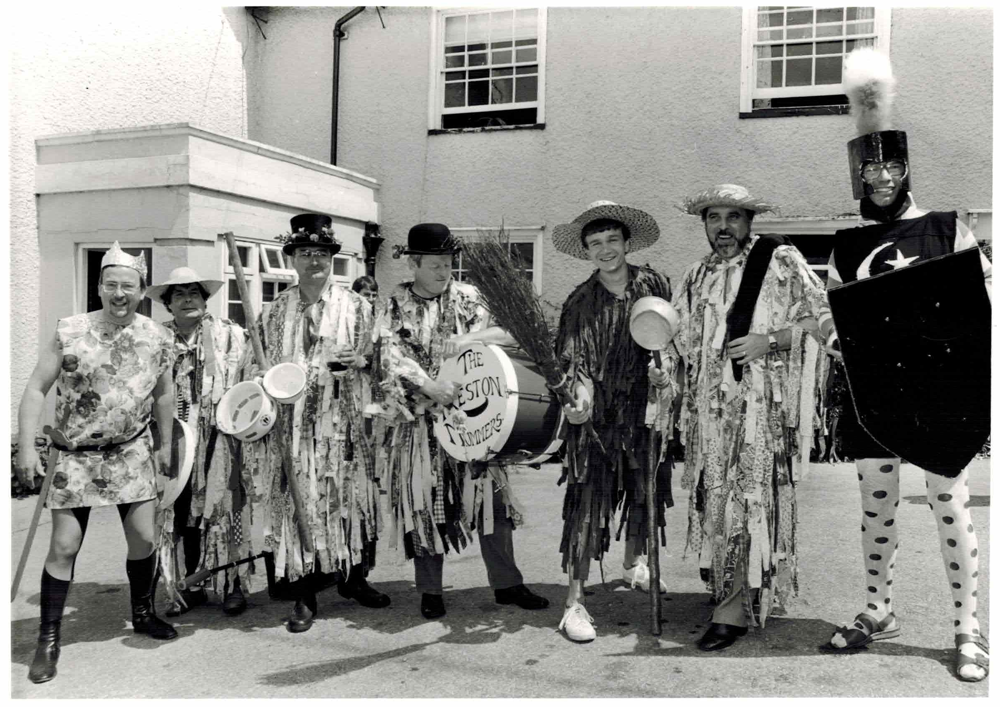
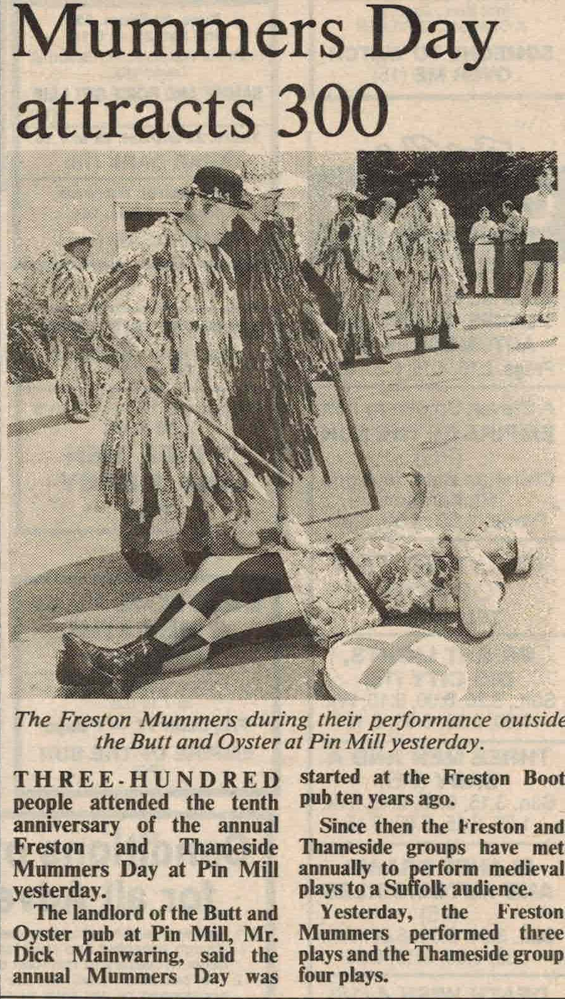

# The Famous Freston Mummers

Sadly the Famous Freston Mummers are no more but this used to be our glossy!

## Who are the Famous Freston Mummers ?

Back in 1978 a troupe of Mummers from south Essex, The Thameside Mummers, visited The Freston Boot Public House and performed their plays. They provided the on-lookers with such good entertainment that a few of the locals decided to form a Mumming troupe of their own. They subsequently became known as "The Famous Freston Mummers".

## What do the Famous Freston Mummers do ?

The Famous Freston Mummers are famous (even though you may not of heard of us) for performing Mumming plays. A Mumming play is the best known type of English folk-play and the plays are derived from the folk festivals of primitive agricultural communities.

There are many types of Mumming plays, Hero-Combat plays, Tup plays, Sword Dance plays, Plough plays, and Robin Hood plays. The words to these Folk plays, like folk songs, are normally passed on from generation to generation by word of mouth. Indeed, it is not uncommon that if a Mummer retires from the troupe that his place should be taken up by his son. Mumming plays have been performed in many of the far reaching corners of England, Ireland, Scotland and Wales and are still performed to this day.

## Where can I see the Famous Freston Mummers ?

Because the origins of the Famous Freston Mummers is at Freston, and most of its members live locally, we do try to perform to a local audience. However, never being ones to spoil a good thing, we do travel. In the past we have taken part in such events as the Felixstowe and Walton folk weeks. We have also been called upon to open garden fates, school fates and we have even performed at medieval banquets.

## When can I see the Famous Freston Mummers ?

By tradition, the plays are performed at certain times of the year, Plough Monday, Good Friday, All Souls and of course Christmas time.

The troupes mainstay performance is on our annual "Mummers Day" which is held on the nearest Sunday to the summers solstice at the Butt & Oyster Public House, Pin Mill, Ipswich, Suffolk. On this day we are normally joined by the Thameside Mummers and we each take it in turn to woo our audience into rapturous applause - and the odd drink, or two.

## Why do the Famous Freston Mummers do it ?

The custom of Mumming nearly died out in Victorian times due to an over zealous reaction by the authorities, who took a dislike to the pagan connections and also the uproar which frequently accompanied the performances. It is only by the work of Mummer troupes, such as the Famous Freston Mummers, that the traditions are still around today.

## Would you like to join the Famous Freston Mummers ?

The Famous Freston Mummers are always on the look out for people to help us keep alive the mumming traditions. We need people to perform, people to help make the costumes, people to help make the props, musicians to provide the music, groupies to provide morale support when we forget our lines. If you think you would like to support the Mummers then please come and help.

